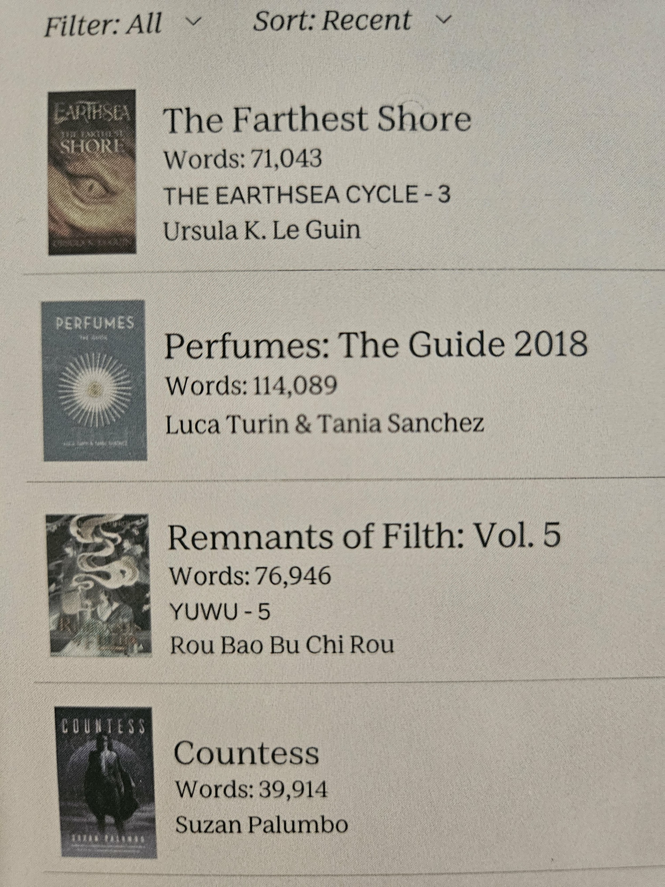
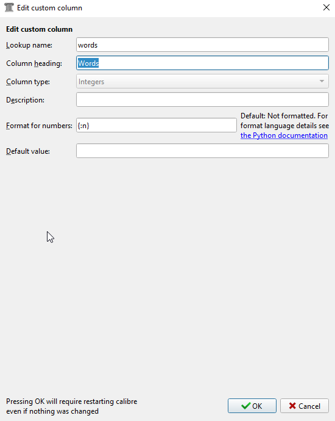
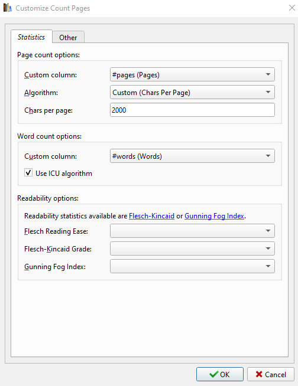
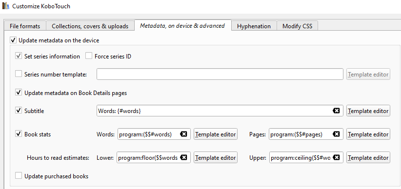

I can gauge how long it’ll take me to read something much more easily if I have an approximate word count to go off of, as opposed to an actual “estimated reading time” or page count (how many words are on a page, anyway?) I find “page” estimates vary much more widely between devices and programs than word counts do, so I’d rather rely on word counts. Having terminal AO3 brain is also part of it, I’m sure—I’m just used to thinking about story length in this way.

My vision, my beautiful vision:

You will need:

- a Kobo ereader – I’ve tested this method on a Libra Colour and Clara HD
- Calibre – I used version 8.5, can’t speak to previous versions
- the Calibre plugins Count Pages and Kobo Touch

This method only works with EPUB/KEPUB files, not PDFs or other formats. This tutorial also assumes you’re side-loading all your books, as I don’t believe it would apply to any books that are not being managed via Calibre. You can download books from the Kobo store to your computer and send the version in your Kobo library to your archive to avoid it appearing on your device as a duplicate.

## step one: word count as custom column in calibre

Open Calibre. Preferences → Interface → Add your own columns → Add custom column. 

Use the following settings:

* Lookup name: words
* Column heading: Words
* Column type: Integers
* Description: blank
* Format for numbers: {:n}
* Default value: blank

Like so:

Hit OK and then Apply. Calibre will restart. 

Preferences → Advanced → Plugins → Get new plugins → search for and install/enable **Count Pages** → Customize plugin.

Though the plugin is called Count Pages, the feature we’re concerned with is the second category here, **Word count options**. Under “Custom column,” select your new column, “#words (Words)”. (This should just appear in the drop-down menu; if it hasn’t, try restarting again, otherwise check to make sure the previous steps were followed correctly.) Keep the “Use ICU algorithm” box checked and hit OK.

To test if it’s working, click an ebook in your library. Hit the arrow by the Count Pages button on the toolbar → Estimate page/word counts → “Yes” when it asks if you want to update column with new statistics. Assuming that went well and the new column was updated with the word count for that book (you may need to scroll over to the right in order to see it if you have many columns), go ahead and follow the same process with all the books in your library. 

## step two: word count as subtitle on kobo

If you’re using your Kobo with Calibre, you probably already have the plugin Kobo Touch installed, but you should check just in case.

Preferences → Advanced → Plugins → Get new plugins → search for and install/enable **Kobo Touch** → Customize plugin.

Go to the **Metadata, on device & advanced** tab and fill out the following:

Make sure the calibre column names (e.g. #words) are correct! if there are discrepancies, the process won’t work.

Hit “OK.”

The next time you connect your Kobo and hit “Refresh cached metadata” within the device management settings, the information should be updated and you should see the correct subtitles on your device. If it’s not working the first time, eject and re-connect your device—I’ve sometimes found the word count totals won’t load the first time I send a book to the device, but the next time I connect it to the computer via USB the word count subtitle will be updated.

These notes were taken after the fact rather than as I went, so if you run into issues, let me know—I may have missed a step.

## resources: 

Some guides I’ve linked make references to the Kobo Touch Extended plugin. These features have since been folded into the plugin just called Kobo Touch. Kobo Touch Extended is deprecated and will fail to install on up-to-date versions of Calibre.

* [GUI Plugin - Count Pages](https://www.mobileread.com/forums/showthread.php?t=134000)
* [Set up Kobo Touch Extended](https://imgur.com/a/set-up-kobo-touch-extended-mEUlRmq) – guide by, I believe, [Sensitive_Engine469](https://www.reddit.com/user/Sensitive_Engine469/) on reddit
* [Is there a way to display different metadata on kobo with calibre?](https://www.reddit.com/r/kobo/comments/16ywpp1/is_there_a_way_to_display_different_metadata_on/)
* [MobileRead: How to add subtitle field in KOBO](https://www.mobileread.com/forums/showthread.php?t=344078)
* [Managing Tags in Calibre](https://imgur.com/a/managing-tags-calibre-S4hJwUN) – not specifically relevant to the word count thing but helpful if you want to set up automatically populating collections on your Kobo using similar functions of Kobo Touch extension
