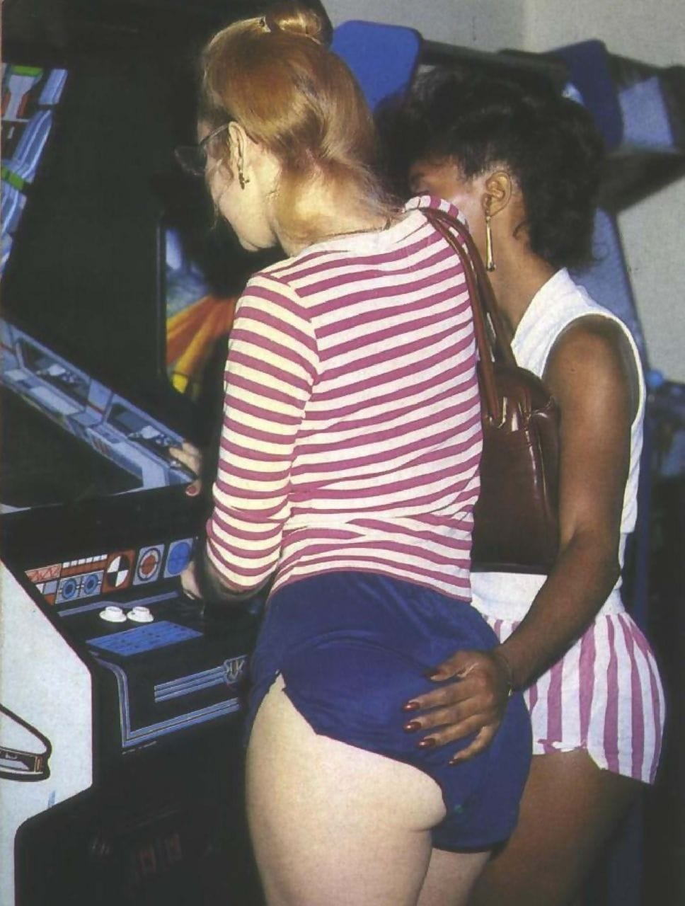
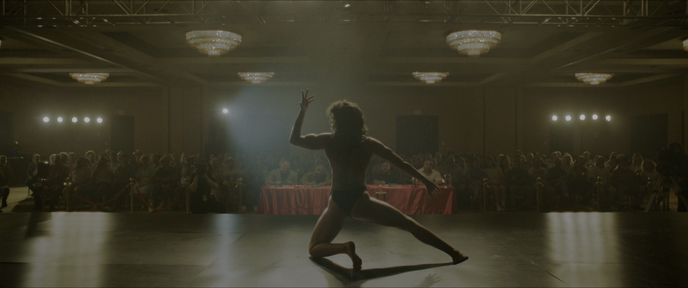
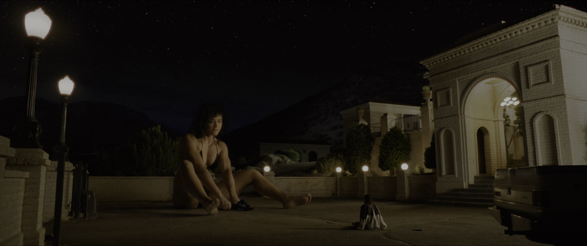

There's an image frequently circulated on tumblr, often captioned something along the lines of "vintage lesbian couple." It's a professional-quality photograph of a pair of women at an arcade, with one's hand on the other's ass. [Many](https://www.reddit.com/r/blackmirror/comments/5o8v4k/original_inspiration_for_san_junipero/) [people](https://www.reddit.com/r/blackmirror/comments/5o8v4k/original_inspiration_for_san_junipero/) [have speculated](https://www.reddit.com/r/blackmirror/comments/99g570/this_photo_had_to_be_the_inspiration_for_san/) that the image inspired the *Black Mirror* episode "San Junipero"–otherwise known as "the lesbian one"–on the basis of some resemblance between the people in the photograph and the episode's two leads. In an AMA, the episode's writer denied seeing the image before "San Junipero" was created. 

The similarities present can be explained by coincidence–there's a white redhead with glasses and a Black woman with her hair up, in an arcade–and the fact that 80s fashion is both consistent and singular, but it's a persistent rumour. I'd encountered it in the wild and taken it at face value, though I should have known better than to think that pieces of mildly viral content among queer millennials would be on the radar of male TV writers. To puncture the dream further, what many credulous bloggers have taken for a snapshot of affection between a real queer couple of the past is actually a contextless crop from a porn mag shoot. 
However, throughout the back half of Rose Glass's *Love Lies Bleeding* (2024), Jackie (Katy O'Brien) wears a similar outfit to one of the women in the photograph, and for a moment in the theatre I considered whether it was possible that this was all part of an extended 80s nostalgia lesbian iconography cinematic universe, before coming to my senses. 

*Love Lies Bleeding* is the anti-"San Junipero," though they're both scored by Clint Mansell. Rather than a sunset-tinged wonderland–a world after Stonewall but before the public internet–the 80s in *Love Lies Bleeding* are a desperate, lonely, image-obsessed time where people smoke indoors, petty kings rule by money and violence, and queer people can live their lives visibly, but only just. The film's soundscape contains a few diegetic disco holdovers as well as a peppering of comfortingly robotic analog synthesizers, but Mansell's score is dominated by eminently 2020s tense string arrangements and bleep-bloop electronics that flicker like bulging veins. Prominent use of aerial drone photography during key sequences similarly serves to shake the viewer by the shoulder any time they're tempted to soak in the period aesthetic too comfortably.

Lou (Kristen Stewart) is the disaffected manager of a Nevada gym owned by her semi-estranged father (Ed Harris). She sticks around, despite her desire to distance herself from her gangster family, out of concern for her sister Beth (Jena Malone), whose husband JJ (Dave Franco) beats her. Her status quo is disrupted by the arrival of Jackie, a drifter and aspiring bodybuilder hitchhiking her way up to Las Vegas for a competition. Lou and Jackie hit it off, and don't make it through their first evening together without the smitten Lou offering Jackie free steroids, which Lou chivalrously injects into her ass.

The pair quickly become lovers, and Jackie becomes the vessel for Lou's frustrations, desires, and ambitions. Lou supplies a roof over Jackie's head, a gym at which to train, drugs to help her bulk up, and emotional support to pursue her dream. But if Jackie is an open flame by the pyre that is Lou's dysfunctional crime family, Lou has been dousing the premises with gasoline; after JJ batters Beth so severely she is hospitalized, Jackie beats JJ to death in his home. Lou struggles to cover up the crime while Jackie insists on going ahead with her Vegas tournament debut, and events snowball until Lou is forced into confrontation with her father, during which Jackie saves her at the critical moment. 

Though Kristen Stewart has first billing and Lou serves as the perspective character, Jackie is the protagonist of the film. Lou keeps her head down, reacts to the chaos around her, and attempts to manage situations and get her people through. Jackie's choices move the plot forward at every stage. She is the object of the film's gaze, in love interest fashion, but hers is the arc of the tragic hero. In noir terms, Jackie is the clear femme fatale to Lou's cynical detective, and in lesbian cultural terms, Lou is the butch to Jackie's femme, despite Jackie being taller and orders of magnitude stronger. Let's say they're deuteragonists and call it a day–but this inability to draw clear lines in terms of narrative, genre, or gender roles reflects the enmeshment at the story's heart.

The film is at its most "unflattering period piece" when it dwells on the grime under the glitz under the grime. The 80s were the decade when culture at large became preoccupied with fitness, as we now know it today; it's also the era of Saturday morning cartoons and family values, as we're reminded by Beth's brood of children her deadbeat husband fails to help her raise. 

Female bodybuilders pursue a state of physical perfection that is informed by cultural mores, but pushes them to a point of excess. Jackie is derisively referred to by Lou's conniving ex as "that beefy girl." There is clear pleasure being taken–and the viewer is invited to take–in the balletic movements she makes before the mirror as she prepares for the stage, but as Jackie becomes more dependent on steroids, the framing of her movement becomes more chaotic and tortured, rarely offering a neatly composed view of her body as a whole. She achieves such visual balance only shortly before vomiting on stage in Las Vegas.

The abjection doesn't contradict her power and grace so much as serve as a punchline to the macho motivational slogans plastered about the gym in the film's opening: *pain is weakness leaving the body*. It's possible none of this can be salvaged; everything is rotten; everyone is compromised; but what is clear is that the Family is not a refuge, and we're left to turn to the other things we use to survive deep hurt: drugs, alcohol, cigarettes, sex, adrenaline, power, love.

The built body appeals to subcultural sensibilities, and the film frequently draws on gay and lesbian pornography as a touchstone. The sex scenes involve toe-sucking and discussion of fisting (on different occasions.) An FBI agent makes a face while skimming a copy of Pat Califia's *Macho Sluts* found in Lou's apartment. 

Above all, the camera pays obsessive focus to the churning, organic-mechanic operation of bodies that are rendered anonymous by their pursuit of optimization. At the same time, it suggests that effort put toward making gains testifies to the stinking, sweaty, glorious vanity and libido that drives the individual lifter to the lift. The climactic confrontation with Lou's father is resolved by Jackie defying Lou's warnings and coming to her rescue as a 50-foot woman, in a dreamlike, ecstatic, baldly fetishistic sequence that caused this reviewer to remember that the film's tagline is "Revenge gets ripped." 

The couple leave the carnage behind and flee, as fugitives, to California, as have many queers before them. The soft pink-and-lilac starry sky almost suggests we've landed back in the tonal and aesthetic territory of San Junipero, with its virtual reality paradise of 80s on the west coast, where there's no homophobia, no Reagan, and certainly no AIDS. 

This is not that world. In the end, the dead body in the back is revealed to be not-quite-dead, and Lou pulls over on the side of the road to choke her ex to death and bury her in the desert. Lou lights up over Daisy's corpse; Jackie sleeps peacefully in the passenger seat. 

It's inaccurate to say the film is without nostalgia, but it's a bittersweet nostalgia for a grimier era of queer cultural production. The movie smells like sweat, but there's a limit to how nasty, how really unsettling things can get. [This is A24, after all](https://dirt.fyi/article/2025/05/the-popular-alternative0).