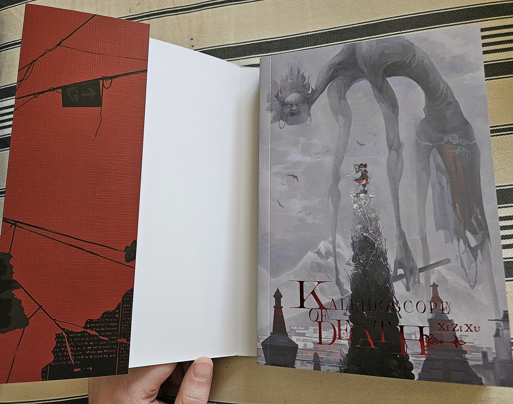
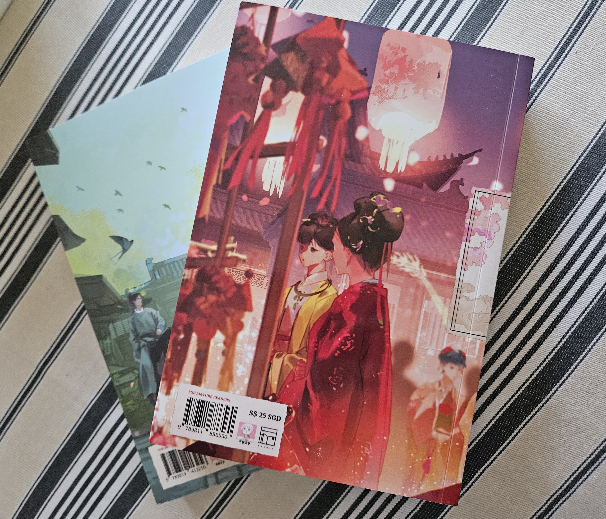

One of the major players in the landscape of English-language cnovel licensing is a Singaporean boutique publisher by the name of Rosmei. Their reputation is mixed, largely due to the fact their [licenses are region-locked to Singapore](https://www.danmeinews.com/2023/06/08/why-cant-rosmei-sell-english-danmei-books-to-north-america/) (in some cases also Malaysia) and do not include ebooks. This means the only way to buy their books in much of the world is to order hard copies via group orders or one of Rosmei's partner distributors, which tend to be small specialty booksellers.

I have a real fascination with the material culture that arises where transnational media fandoms that emerged via bootleg translations "go legit"; it's a big part of what draws me to vintage anime. For this reason, as well as a desire to get an informed comparison point with Seven Seas' approach to branding and localization of their cnovels, I've been curious about Rosmei's titles. However, I don't personally know anyone with copies, so last fall I decided to bite the bullet and order some. 

I’ve made two orders within the last year, from two different distributors, and I’ll go into some detail about the order process as well as the books themselves, in hopes it'll be useful to anyone who may be on the fence about whether to place their own orders through various channels.

## north american retailers

I’m located in Western Canada and not travelling to SEA any time soon, so third party distributors are my only option. Around last summer, I was tossing around the idea of getting a pickup box in one of the nearby American border towns so I could grab occasional deliveries in cases where the domestic shipping cost savings are enough to justify the hassle of crossing the border. I decided to order a few Rosmei titles as a test case. 

### yiggybean

[Yiggybean Books + Gifts](https://yiggybean.com/collections/rosmei-titles) is a Seattle-based retailer primarily dealing in BL manga and LNs, with some GL and other East Asian queer print media in there as well. They were the first of Rosmei’s official North American distribution partners, and remain the best-known.

Yiggybean’s website is… not great (we’ll get to Rosmei’s own website in a bit).  It's tricky to navigate if you’re looking for additional information before placing an order. Despite a banner at the top of site declaring that they ship internationally, there’s no “Shipping and returns” or similar page to be found. They presumably calculate shipping costs on the back end once you’ve filled your cart and entered your address, but don't provide any ballpark estimates or guidance before you get to that point. I was too lazy to fill a fake cart right now just to figure out what the CDN shipping cost would be for the sake of this post; forgive me. 

I find it extremely annoying when companies do this. I don’t want to waste my time shopping if the shipping costs to my country are prohibitively expensive. Even some general info, especially regarding minimum dollar values or return policies for international orders, is much appreciated. In any case, Canadian shipping costs weren’t relevant when I placed my order, since the point of this was to test whether cross-border deliveries were worth the trouble... but I still like to know my options. 

(One last website gripe: I find the default pink text-on-white-background on Yiggybean’s website pretty difficult to read. There’s a floating accessibility tool you can use to adjust the display client-side, which I find a bit amusing—they have enough self-awareness to know the site is hard to read by basic web accessibility standards, but not enough to, you know, change the default display? Anyway.)

Yiggybean currently offers free shipping for orders over $100 USD within the continental US. I think it was a $10 USD flat fee at the time of my order, for a package of about that value.

I placed my order on September 30, 2024, containing the first volumes of _How to Survive as a Villain_, _Kaleidoscope of Death_, _Coins of Destiny_, and _Nanchan_. Despite a 6-8 week ballpark for orders to arrive from Rosmei to Yiggybean’s warehouse, my order wasn’t shipped out from Seattle until January 22. As far as I can tell, this was neither the fault of Rosmei nor Yiggybean; a bulk order containing volumes of _Nanchan_ got stuck in customs purgatory and needed to be sent back and reissued from Singapore. These are the kinds of risks to be aware of when buying this kind of goods. Part of why I ordered via a retailer rather than a group order through [Northwest Flower GO](https://sites.google.com/view/northwestflowergo) was the (possibly naive) belief that this kind of thing is less common the more “legit” the distributor; I was probably right to assume in the first place that even if a shipment did get impounded, it'd have a better chance of getting recovered if I went through an established retailer. I did get the book in the end, after all.

Yiggybean made a post on their [blog](https://yiggybean.com/blogs/default-blog) about the situation and mentioned it on the _Nanchan_ product page before I placed my order. However, I found it frustrating that, as the months went on, the occasional status updates they logged in the blog post were never sent out by email to the people waiting on these orders. The only way I was able to keep up with what was going on was by refreshing the blog post every so often. 

Yiggybean made their last update about the _Nanchan_ delay on December 16, announcing that the shipments had finally arrived and the first batch would be shipped out ASAP. Based on when I placed my order, my books were part of another, later batch; I reached out to Yiggybean on Jan 16 inquiring about a fulfillment ETA, and got a same-day reply letting me know the order would be shipped and packed over the next few days, which indeed it was. Domestic delivery from Yiggybean’s warehouse to my package pickup service was quick.

Communication levels around the delay weren't a huge issue; I would definitely order from Yiggybean again if there weren't a domestic alternative (or the border considerations.) My goal here is to set expectations for folks such as myself who don't have a lot of experience with overseas orders.

In a bittersweet turn of events, the delay meant that I was able to have the copies of _Peach Blossom Debt_ and _The Imperial Uncle_ that I ordered from Peach Flower House upon the announcement of that press folding sent to the U.S. package service for pickup at the same time. 

However, the timing with Geopolitical Events meant that my experiment died in the cradle, being that I am no longer willing to cross the U.S. border for frivolous reasons. Luckily, a Canadian retailer had recently announced a distribution partnership with Rosmei…

### the beguiling

[The Beguiling Books & Art](https://beguilingbooks.com/lists/LYY-7lYxmA6I) is a Toronto-based comics and bookstore specializing in graphic novels, alternative and international comics, and artbooks, with a healthy proportion of queer material.

By late February, I had made a dent in my first Rosmei order and also my cat had just died. I responded to this by blowing most of my book budget for the coming months on an order from The Beguiling, containing mostly other Rosmei preorders.

They offer flat rates for domestic retail orders—$15 CAD within Ontario & Quebec or free shipping of orders $200+, and $20 CAD/$300+ for the rest of the country. (Shipping info on international orders can be found on their [FAQ](https://beguilingbooks.com/faq) page.) I decided to ball out and get over the free shipping hump by ordering some 7S volumes as well as the Rosmei preorders.

The Rosmei titles were all preorders, even the one that was already on shelves by that date—Yiggybean and The Beguiling both get their Rosmei titles via bulk orders, rather than keeping a lot of copies on hand (though I haven’t visited The Beguiling’s brick and mortar stores, and have heard they have some Rosmei titles on display!) I ordered _How to Survive as a Villain_ 2, _Nanchan_ 2, _The Earth is Online_ 1-2, _Global Examination_ 1, and _The Defectives_ 1. 

The Beguiling’s communication throughout the process was excellent. Shortly after I placed my order, a staff member reached out by email to confirm that I was aware that those volumes were all preorders, and offered me the option to pay the flat shipping fees to have the 7S volumes shipped out immediately and the preorders go out together when they were all in. I was okay to wait for the whole package, but I appreciated the thoughtfulness and organization on their part. They then reached out in March to let me know that the copy of _Global Exam_ was in, and again in May when _Earth is Online_ and _Survive as a Villain_ had arrived, letting me know each time that I didn’t need to reply to the email but could do so if I’d changed my mind and wanted the books sent over early. They reached out again on June 20 to let me know the last batch of special orders were in and the order would ship out in the next couple of days. They provided a Canada Post tracking number once one was available and the books arrived on my doorstep without issue.  Again, I really appreciated the care taken to keep me in the loop—they could have easily not gone to the trouble, but it felt great to not just be in the lurch of “at some point in the next six months these books will probably show up but I don’t know when,” which I was prepared for!

I would definitely order from The Beguiling again, though I’ll wait until there’s another $300 CAD worth of books I want, which will probably be… a while. 

## overall impressions

I’ll start with the bad, and work toward the good.

Rosmei’s [website](https://rosmeihey.top/) is atrocious. Its information architecture is a mess, it has a “site under construction” banner up top despite having published dozens of books at this point, and it's missing cover art and/or summaries for some novels that have _already been released_, such as _The Defectives_, volume 1 of which I am physically holding at this moment yet is still listed as “TBA” on their [Synopses](https://rosmeihey.top/pages/introductiontorosmeipublications) page. The extant summaries are also problematic, as the copywriters have a baffling habit of referring to characters by their surnames alone, something which is not done in the books themselves.

The information I’m most frustrated about not having access to is the planned number of volumes for each title and projected release schedule. I can go to NovelUpdates and do some math to get estimated volume totals, but I shouldn’t have to! This is pretty basic stuff for a professional publishing company, even a young boutique press.

So far, Rosmei has maintained a glacial release schedule for most of their titles, with one or two volumes coming out a year. This in combination with the lack of clarity around total volume numbers doesn’t inspire a great deal of confidence. I don’t want to have to count on a small publisher being around for the next five years just to finish reading a single novel. As a reader, I have to either remember what’s happening between volumes that release once or twice a year, or stock up on volumes until the undertermined point at which I can read them all in one go. It comes across as either disorganization or cynical money-grabbing (might as well pick up some more volume ones while you wait, right?), and possibly both. (Except then they’ll sometimes release books in sets containing volumes one and two, such as _The Earth is Online._ Why????)

This is, in large part, what motivated me to write this post—their underwhelming online presence makes it hard to get a good sense of what you’re actually getting when you buy their books, which is a particular issue when placing expensive overseas orders. 

The good news is that the above is the worst of it, as far as I can tell. My expectations were very low, but I’ve generally been pleasantly surprised by the books themselves, though they’re not without issues. 

### design

Rosmei’s editions are kind of all over the place, which I don’t mean in as negative a sense as it probably sounds. If I saw them on a shelf in a bookstore, the press’ logo on the bottom of the spines is the only clue that these books are from the same publishing house. This stands in stark opposition to Seven Seas’ cnovel releases, which all follow a fairly rigid design formula (though they’ve gotten somewhat more elegant in recent times—compare _Ballad of Sword and Wine_ and _Love Between Fairy and Devil_ on the left with the MXTX volumes on the right.)

Rosmei publishes some volumes in hardcover and some in softcover; I’m not sure what contributes to these decisions. Bizarrely, some of their hardcovers come with dust jackets and some do not… and this is also true of their paperbacks. Of the books I own (which are by no means all of their danmei titles), _Nanchan_ comes in hardcover with a dust jacket and _The Defectives_ without a dust jacket, while _Kaleidoscope of Death_, _Coins of Destiny_, and _Global Examination_ are paperbacks with dust jackets and _How to Survive as a Villain_ and _The Earth is Online_ must make do as lowly naked paperbacks (though they have French flaps.) This seems a bit overly complex from a production standpoint, but what do I know. Strangely, they don’t use the dust jackets or flaps for much of anything besides more room for art; they certainly don’t provide much in the way of information on the author or the books themselves (but more on that later.)

What the dust jackets _do_ offer is the ability to present a more neutral cover design and hide the shippy art as a special treat for the initiated. The jacket covers for _Global Exam_ and _Nanchan_ are far more memorable than their interior covers, and _Kaleidoscope of Death_’s interior cover comes as a bit of a thrilling surprise after its relatively restrained front cover.

There are some dubious choices, especially their tendency to go hogwild with fonts in some of the front matter (it’s okay to just use, like, two fonts! Maybe three max!), but Rosmei's editions are far and away the most attractive of the three danmei publishers whose work I’ve seen in person (the other two being 7S and Peach Flower House [R.I.P.], though I think the MXTX hardcover reissues are an attempt to address this on 7S' part.) They often include textured endpapers and foil stamped titles. _How to Survive as a Villain_ is definitely the closest to what I think of as a typical danmei design treatment, and it was the first of their releases, so it’s interesting to see how their approach has evolved. 

_The Defectives_ makes up for its lack of dust jacket by having a glittering metallic cover. It just feels fancy. 

Between the covers, the books' paper is cream in colour and fine enough to allow for some unobtrusive ghosting of print on the opposite side of the sheet. I find the physical experience of reading these books much more enjoyable than that of 7S’ editions, which I’d describe as “workmanlike,” and it's remarkable how much of a difference it is for eye strain to not have to deal with blindingly white pages. 7S’ editions do have interior illustrations, though, which Rosmei’s volumes do not. 

The most notable aspect of Rosmei’s design strategy, to me, is the relative absence of characters. This isn’t a complaint; there’s only so many illustrations of prettyboys in hanfu I can keep track of before my eyes start to blur in the face of Extruded Danmei Product. I’d much rather have something more unique, and Rosmei’s editions (that I own, anyway) seem to aim more for “vibes and atmosphere” than “here are the guys! Aren’t they hot?”

However… it drives me absolutely bonkers how little information is included anywhere on the books themselves about what they contain, let alone about their authors! For back cover blurbs, Rosmei generally takes the “lazy AO3 summary” approach, i.e. including a contextless snippet of one to three lines from the story and banking that the reader will be sufficiently intrigued to click. 

It’s kind of funny that Rosmei’s ultimate Achilles heel appears to be “writing decent summaries,” because I wouldn’t want them to include the ones from their website either, due to aforementioned issues. It’s just, like… how hard can this be? It feels like they’re banking on prospective readers already being familiar with the books via word of mouth, or maybe just seduced by the sexy cover art. _How to Survive as the Villain_ has to be the funniest example, as they don’t even have the AO3 summaries; the back covers are just… blank. Blank space. Nothing on the flaps either (except art.)

Like. Okay??????

Granted, I’m zero percent familiar with the publishing landscape in Singapore and it’s possible that some of these choices are less strange in context than they feel to me. I’d be interested to learn more if this is the case.

EDIT: after some discussion on the cnovels Dreamwidth comm, it sounds like publishing conventions across East Asia are variable in this regard. In any case, regardless of standards and conventions within Rosmei's regional publishing sphere, the international English readership is a pillar of their business model and it behooves them to do some basic market research about what said audience will expect.

### translations

I haven’t read through the entire stack yet, and I imagine translation quality varies between translators and editors. I grew up on dodgy TokyoPop manga localizations, and my first exposure to cnovels was through fan translations rough enough I couldn’t get past the frustration hump for some time. For these reasons, I’m sometimes more charitable towards passable-but-not-stellar translations than I should be. I’ve also just read enough of these works by now (+ fanfic for these canons, which often pick up phrasings and sentence patterns from the translators) that I suspect I’m inured to common clunky translation conventions in these spaces. This is all to say: take these impressions with a grain of salt.

I find most of Rosmei’s danmei translations to be, like, “fine.” They’re readable. I find the stories easy to follow and don’t find myself stumbling over sentences too frequently. The jokes generally land. They could use tighter editing; meaning is pretty clear, but they definitely read as works in translation. This problem is by no means limited to Rosmei. The licensed cnovels about which I wouldn’t say the same are few indeed, though degrees vary.

As I can’t read Chinese, I hesitate to go too deep into critiquing individual translations, as I can’t speak to accuracy, or to how a given author’s voice impacts the way a translation comes out.

Regarding house style, it seems to be Rosmei’s convention to italicize terms such as gege and Shifu, which irritates me. At least they include them. _Coins of Destiny_ has a bizarre quirk wherein the words “yao” and “human” are rendered in sᴍᴀʟʟ ᴄᴀᴘs, but I’m not yet sure whether that’s true across Rosmei’s books. It’s very odd and distracting either way.

TL;DR—considering pure readability/unobtrusiveness (rather than prose quality on any other axis), I’d consider Rosmei’s translations serviceable. On average, a bit worse than median 7S danmei, though there are variations in quality across both publishers’ works.

### merch & freebies

So far, all my Rosmei books have come shrink wrapped with packages of freebies, but my understanding is that it’s an “as supplies last” kind of thing, so future print runs may not have them. That’s honestly fine by me, as I find it a bit burdensome to store and display all these little postcards and things. They live in a ziploc bag in a drawer right now. It’s my understanding that this merch is included as a freebie incentive for placing preorders, rather than being an extra bonus you get by ordering a “special edition,” as is the case for 7S’ equivalents. 

(Not the point of this post, but can I just say I find calling them “special editions” misleading in this case—I don’t think there’s anything different about the actual editions of the books, they just ship with extra items! Call them something else!)

It varies somewhat from book to book, but the standard Rosmei merch package tends to include a bookmark, a postcard, a small art print, and another item, often a chibi-style cutout character. There’s sometimes other items as well.

Possibly my favourite thing Rosmei has done is the inclusion with _Kaleidoscope of Death_ of a “blooper reel” pamphlet compiling text omakes and author’s notes for the relevant chapters. It’s very cute and not the kind of thing I can imagine 7S ever including. I enjoy the throughline drawn with the work's online origins, and the presentation of the pamphlet itself is endearing.

It’s the little things.

## was it worth it???

I don't regret placing the orders; they satisfied my intellectual curiosity, and I enjoy getting to read licensed cnovels. 

I'll be very curious to see where the English-language BL and GL cnovel cottage industry goes in the years to come. I really value the opportunity to see what publishers other than Seven Seas do with their titles, especially as there are lots of danmei and baihe works out there that don't really fit the Seven Seas mould but that deserve a wider audience (pouring one out for _The Imperial Uncle_, now out of print in English and god knows if that will change any time soon!) That said, there's a lot to critique about Rosmei's business model as well as the quality of their output. Many others have written on this, so I'll leave it at that for now.

Recommendations of specific works will vary, and I hope to share more detailed reviews in future. 